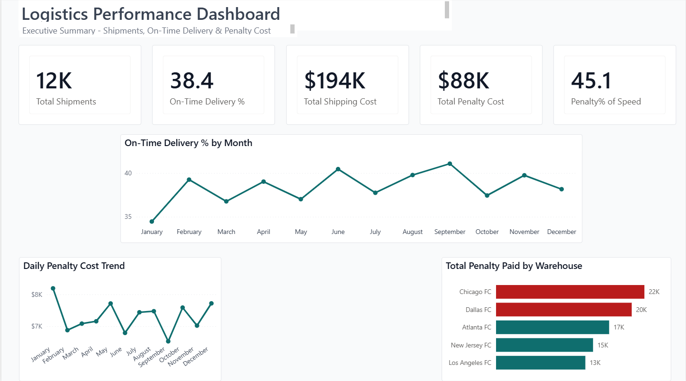
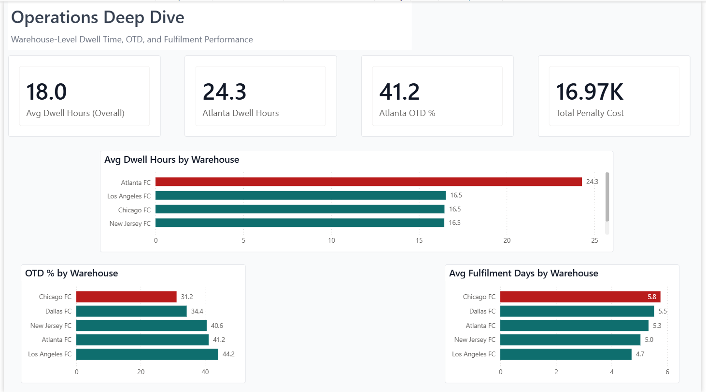
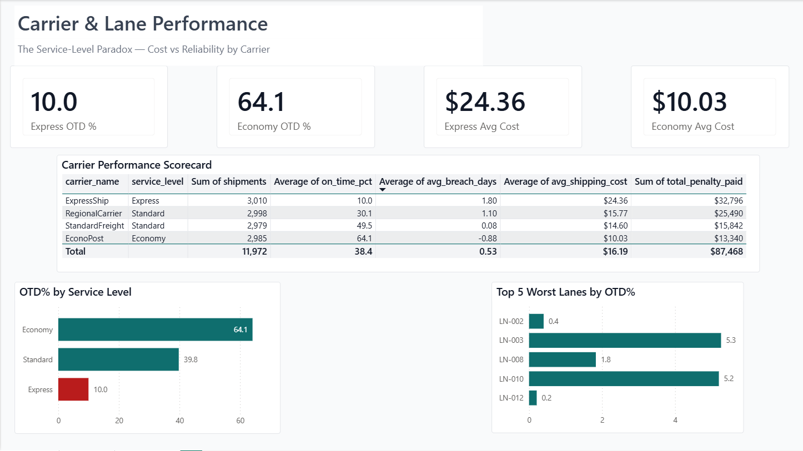

# Logistics Performance Dashboard
### Why is this network losing $87K to late deliveries?

A Python → PostgreSQL → Power BI investigation of 12,000 shipments across 5 warehouses, 4 carriers, and 25 lanes — built end-to-end to surface where the money is bleeding, *which* warehouse is the bottleneck, and *why* the most expensive carrier delivers the worst service.



---

## TL;DR — Three findings the dashboard makes inescapable

> **1. The network's overall On-Time Delivery rate is 38.4%.** $87K of penalty cost has already been paid this year — 45% of total shipping spend.

> **2. The "worst warehouse" depends on the question.** Atlanta has the longest dwell time (24.3 hrs, +35% vs fleet average) but Chicago has the worst on-time rate (31.2%) and slowest fulfilment (5.8 days). Two distinct problems, two different fixes.

> **3. The Express service-level paradox.** ExpressShip charges 2.4× more per shipment ($24.36 vs $10.03 for Economy) but delivers on-time only 10.0% of the time — a *6× worse* OTD than the cheapest carrier in the network.

These are not insights the executive team would have seen in a flat report. They are insights the dashboard *forces* you to notice — through conditional coloring, deliberate visual hierarchy, and three pages of progressively focused storytelling.

---

## The Problem This Solves

Logistics networks generate enormous operational data, but most reporting stops at "what happened." The questions that actually drive cost reduction are:

- *Where* is the bottleneck — warehouse, carrier, or lane?
- *Which* fix is most expensive to ignore?
- *Why* is a premium-priced carrier underperforming a budget one?

This project simulates a realistic mid-size logistics operation and builds a 3-page Power BI dashboard that surfaces those answers in under 30 seconds of scanning. It mirrors the kind of operational analytics work I supported during my Strategy & AI Consulting internship at **Total Quality Logistics (TQL)**.

---

## The Three-Page Story

The dashboard is structured as a deliberate narrative — **overview → operations → root cause** — so a stakeholder can stop after Page 1 and still walk away with the headline, or drill all the way to the cause if they have 10 minutes.

### Page 1 — Executive Summary
**The headline.** Five KPIs frame the cost story. The OTD trend line shows monthly performance hovering at 38%. The penalty-paid-by-warehouse chart highlights **Chicago and Dallas in red** — together responsible for **$42K of the $88K total penalty cost**.

> *Eye-test: a reader sees the two red bars in under 2 seconds. Story delivered.*

### Page 2 — Operations Deep Dive


**The warehouse problem, decomposed.** Four KPI cards juxtapose overall vs Atlanta-specific metrics, immediately surfacing that Atlanta is 35% slower than the fleet average on dwell time but *not* the worst on OTD — that distinction belongs to Chicago. Conditional coloring tells the dual story across three warehouse charts:

- **Atlanta in red** on Dwell Hours → the bottleneck warehouse
- **Chicago in red** on OTD% → the delivery problem warehouse
- **Chicago in red** on Fulfilment Days → confirming the second pattern

The page makes a non-obvious operational point: *the worst warehouse for one metric is not necessarily the worst for another.* That's the kind of observation that prevents wrong fixes.

### Page 3 — Carrier & Lane Performance


**The carrier paradox.** A scorecard table compares all four carriers across shipments, OTD, breach days, shipping cost, and penalty paid. The visual story: **ExpressShip charges premium prices for the worst on-time delivery in the network.** Either the cost structure is wrong, the routing is misaligned, or the SLA needs to be renegotiated.

The "Top 5 Worst Lanes" chart surfaces five specific lane combinations (LN-002, LN-003, LN-008, LN-010, LN-012) where OTD has collapsed to under 6% — likely candidates for root-cause investigation before they bleed any more penalty cost.

---

## Tech Stack

| Layer | Tool | What it does here |
|---|---|---|
| **Data generation** | Python (pandas, NumPy) | Simulates 12K orders + 72K stage events with deliberately-seeded patterns and data-quality issues |
| **Storage & transformation** | PostgreSQL | Raw tables → staging views → analytical marts (5 layers) |
| **Visualization** | Power BI Desktop | 3-page dashboard with custom JSON theme, DAX measures, conditional formatting |
| **Version control** | Git + GitHub | This repo |

The pipeline mirrors a production BI architecture: **simulate → load → transform → model → visualize**. Every layer is reproducible from the files in this repo.

---

## What Makes This Project Different From a Tutorial Build

Most portfolio dashboards stop at "I made charts." This project deliberately demonstrates the *thinking* behind the charts:

#### 🎯 **Synthetic data with seeded narratives**
The data isn't random — `simulate_data.py` was designed to *contain* specific patterns: an Atlanta dwell bottleneck, an Express service-level paradox, ~38% network OTD, and ~$88K in penalty cost. This proves I can reverse-engineer a dataset from a business story, not just chart whatever happens to be in a CSV.

#### 🧪 **Data quality as a first-class concern**
The simulator deliberately seeds realistic data quality issues — 15 duplicate orders, 8 orphan stage events, impossible timestamps, missing carrier IDs. The SQL layer (`sql/03_data_quality_tests.sql` and `sql/03b_dq_remediation.sql`) catches and remediates them. Real data is messy; the project shows I know that.

#### 🎨 **Design discipline over chart variety**
The dashboard uses one accent color (deep teal `#0F6E6E`), one warning color (muted red `#B91C1C`), and aggressive whitespace. Conditional formatting drives the story — the eye lands on red bars in 2 seconds. Custom Power BI theme (`logistics_theme.json`) standardizes typography and spacing across all visuals.

#### 📖 **Story-first page structure**
Each page tells one sentence. Page 1: "Here's the bleeding." Page 2: "Here's where it's bleeding from." Page 3: "Here's why." This is how I'd present to a leadership team, not how the underlying database is organized.

---

## Project Structure

```
logistics-analytics/
├── simulate_data.py              # Python data simulator — generates 6 raw CSVs
├── logistics_dashboard.pbix      # Power BI dashboard (open in Power BI Desktop)
├── logistics_theme.json          # Custom Power BI theme — teal + red palette
│
├── data/
│   └── raw/                      # Simulator output — 6 CSV files
│       ├── warehouses.csv        # 5 fulfilment centers (dim)
│       ├── carriers.csv          # 4 shipping carriers (dim)
│       ├── lanes.csv             # 25 origin-destination lanes (dim)
│       ├── orders.csv            # 12,000 orders (fact)
│       ├── shipments.csv         # 12,000 shipments (fact)
│       └── stage_events.csv      # 72,000 stage events (fact)
│
├── sql/                          # PostgreSQL transformations, executed in order
│   ├── 00_create_tables.sql      # Schema + raw table definitions
│   ├── 01_load_data.sql          # COPY commands to load CSVs into raw tables
│   ├── 02_reporting_layer.sql    # Staging views + cleaned joins
│   ├── 03_data_quality_tests.sql # DQ checks — duplicates, orphans, bad timestamps
│   ├── 03b_dq_remediation.sql    # DQ fixes — what to drop, what to flag
│   ├── 04_kpi_marts.sql          # Analytical marts powering the dashboard
│   └── 05_strategic_analysis.sql # Ad-hoc analytical queries used during exploration
│
└── assets/
    └── screenshots/              # Final dashboard captures (rendered above)
        ├── 01_executive_summary.png
        ├── 02_operations_deep_dive.png
        └── 03_carrier_lane_performance.png
```

---

## How To Reproduce This Project Locally

The full pipeline is reproducible end-to-end. ~30 minutes if you have Python and PostgreSQL installed.

### Prerequisites

- Python 3.10+ with `pandas` and `numpy`
- PostgreSQL 14+ (local or remote)
- Power BI Desktop (Windows, free download from Microsoft)

### Steps

```bash
# 1. Clone the repo
git clone https://github.com/sivakumar-reddy/logistics-analytics.git
cd logistics-analytics

# 2. (Re)generate the synthetic data — optional, CSVs are already included
python simulate_data.py

# 3. Create the PostgreSQL database
createdb logistics_analytics

# 4. Run the SQL files in order
psql -d logistics_analytics -f sql/00_create_tables.sql
psql -d logistics_analytics -f sql/01_load_data.sql
psql -d logistics_analytics -f sql/02_reporting_layer.sql
psql -d logistics_analytics -f sql/03_data_quality_tests.sql
psql -d logistics_analytics -f sql/03b_dq_remediation.sql
psql -d logistics_analytics -f sql/04_kpi_marts.sql

# 5. Open the dashboard
# Open logistics_dashboard.pbix in Power BI Desktop.
# Update the PostgreSQL connection to point at your local database.
# Refresh — all visuals will repopulate from your marts.
```

> **Note on the COPY paths in `01_load_data.sql`:** the file uses absolute paths to my local environment. Update them to your repo path before running.

---

## What I Learned Building This

A handful of things this project taught me that I wouldn't have picked up from a tutorial:

- **Design discipline trumps chart variety.** I started with 12 different visual types. The final dashboard uses 4. Restraint, conditional formatting, and consistent sizing did more for readability than any clever chart.

- **The interesting insight is rarely the one you set out to find.** I designed the Atlanta bottleneck deliberately. The "Express service-level paradox" emerged from the data when I joined the carrier and shipment tables — and it ended up being the most compelling story on the dashboard.

- **Synthetic data is harder than it looks.** Generating data that contains *realistic-looking patterns and realistic-looking noise simultaneously* requires careful thought about distributions, correlations, and seeded outliers. Real-world domain context (from my TQL internship) shaped every parameter.

- **A dashboard is a piece of writing.** Each page is a paragraph. Each chart is a sentence. Each data label is a word. Edit accordingly.

---

## Roles I'm Targeting

I recently graduated with an **MS in Management Information Systems** from Northern Illinois University (May 2026), with a Computer Science & Business Systems background from GITAM University. I'm actively interviewing for:

- **Business Analyst / IT Business Analyst** roles — requirements gathering, process analysis, stakeholder communication
- **BI / Reporting / Business Intelligence Analyst** roles — Power BI, SQL, DAX, dashboard ownership
- **Marketing Analyst / CRM Analyst** roles — GA4, campaign analysis, segmentation, lead-funnel optimization

This project sits at the center of those three: **business problem → data infrastructure → visual storytelling**.

---

## 📬 For Recruiters

I'm based in **St. Charles, IL** and open to relocation across the US, hybrid roles in the Chicago metro, and fully remote positions.

- 📧 **Email:** [reddysivakumar1361@gmail.com](mailto:reddysivakumar1361@gmail.com)
- 💼 **LinkedIn:** [linkedin.com/in/sivakumar-reddy-yenna](https://www.linkedin.com/in/sivakumar-reddy-yenna/)
- 📞 **Phone:** (331) 314-4323
- 📍 **Location:** St. Charles, IL

**Best ways to reach me:**
- For role inquiries: **email** with the role title in the subject line
- For quick questions: **LinkedIn DM**
- I check both daily and reply within 24 hours.

---

## A Final Note On How This Was Built

This dashboard was designed and refined through deliberate iteration — I went through three full polish passes, each focused on a different aspect (formatting, color, alignment), and used AI tools (Claude) the same way I'd use a senior reviewer: to challenge design choices, validate insights, and catch the details I missed. That's the AI-augmented workflow I bring to every analysis: human judgment in the driver's seat, AI as a force multiplier for speed and quality.

---

## License

This project is released under the [MIT License](LICENSE). The code, SQL, and dashboard are free to study, fork, and adapt. The synthetic dataset is also freely usable — it was generated by `simulate_data.py` and contains no real-world identifying information.

---

> *If you've read this far, thank you. If you're hiring an analyst who can take a problem from raw data to executive-ready story — let's talk.*
